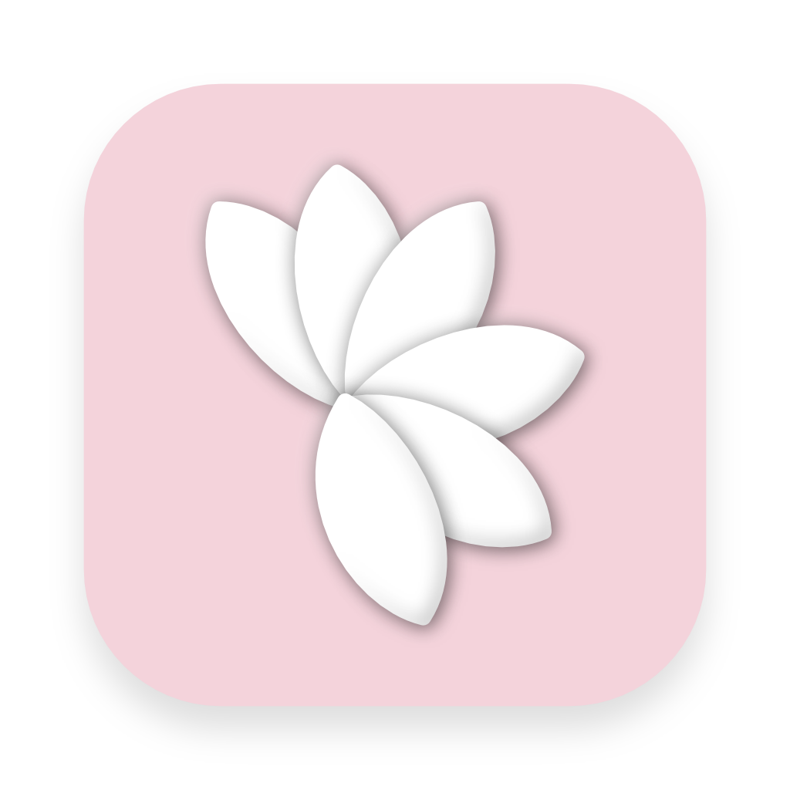

# 🌸 Blossom

> A pocket of calm, anywhere, anytime.

This is a simple little app I built to:

1) Be able to receive a random bit of encouragement at any time
2) Have a random bit of encouragement delivered to me every day

The first is achieved through the [web](https://blossom.nathanyeung.ca) and mobile apps, where clicking on the screen shows a new quote or saying. The second is achieved using the mobile app, which sends a notification every day at 4am.

This isn't meant to be a particularly big or meaningful project, just something I built for a little dose of happiness. Feel free to PR or open issues for bugs or feature requests, but there may be a delay in merging/responding due to the low-priority nature of this project.